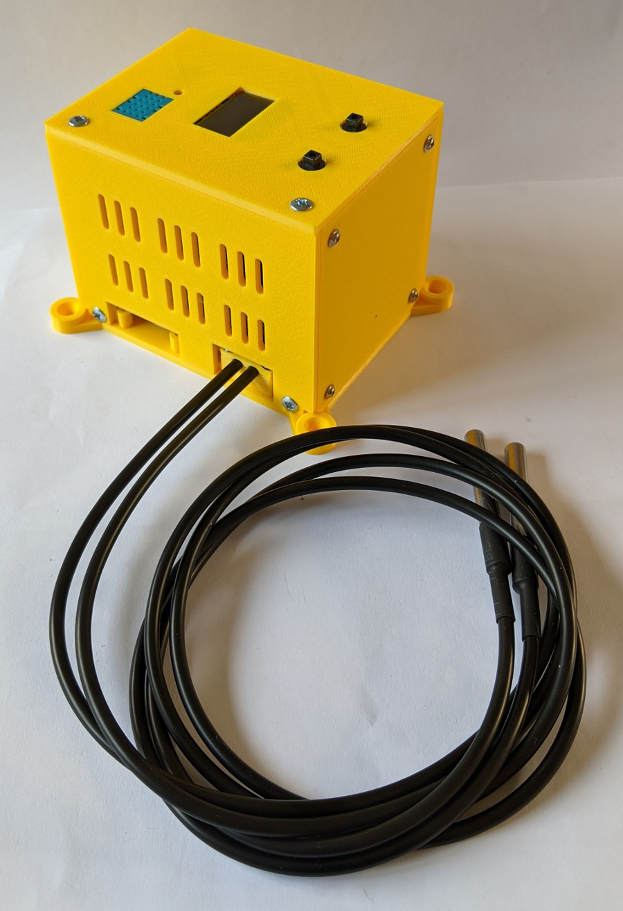
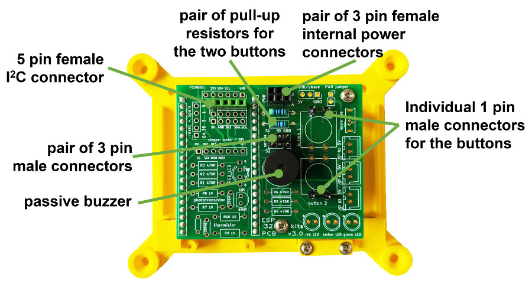

# ESP32 sensor box project
 Documentation plus Arduino IDE C/C++ code for a custom project that uses an ESP32 to manage some sensors with everything housed in a 3D printed 'box' as shown below.

 &nbsp; &nbsp; 

This ESP32 project uses:

 - two metal sheathed DS18B20 sensors (1-wire signal protocol devices) to remotely measure temperature;
 - a DHT11 sensor to measure the temperature and humidity at the box top surface; along with
 - two tactile button for various control purposes; 
 - a passive buzzer to provide audible alarms; and
 - a small OLED display to continuously show the readings and other control/status events.

Using the ESP32 Maker Kit PCB provides an easy way to interconnect the ESP32 to these devices, but as there are not many connections needed, the PCB need only be sparsely 'populated' as shown below.

&nbsp; &nbsp; 

More details about the project are published <a href="https://onlinedevices.co.uk/ESP32+Maker+Kit+-+Sensor+box+project" target="_blank" >here</a> and the designs for the custom 3D printed components will be made available from the Prusa web site.

