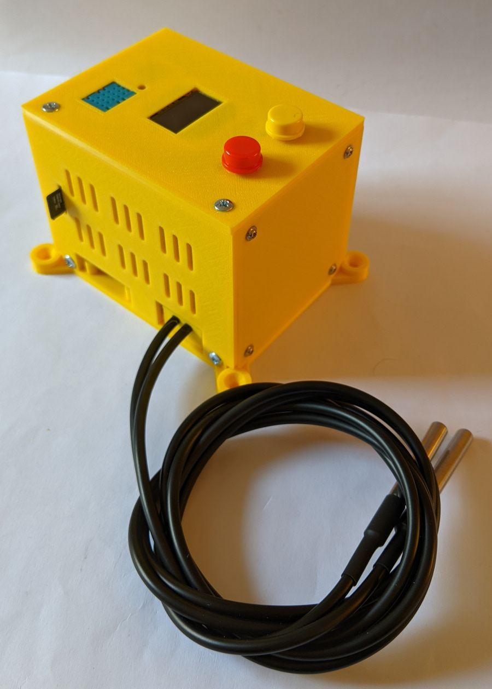
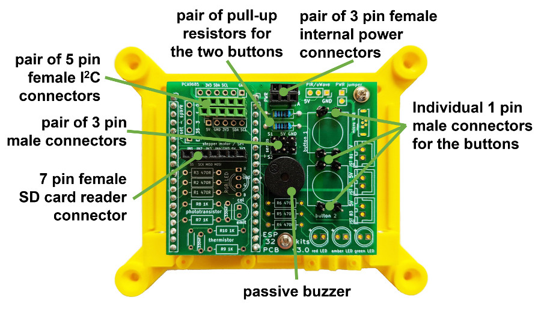

# ESP32 sensor box project
 Documentation plus Arduino IDE C/C++ code for a custom project that uses a 38-pin ESP32 module to manage some sensors with everything housed in a 3D printed 'box' as shown below.

 &nbsp; &nbsp; 

This ESP32 project uses:

 - two metal sheathed DS18B20 sensors (1-wire signal protocol devices) to remotely measure temperatures;
 - a DHT11 sensor to measure the temperature and humidity at the box top surface; along with
 - two tactile buttons for various control purposes; 
 - a passive buzzer to provide audible alarms; and
 - a 128x64 pixel OLED to continuously display the sensor readings and other control/status events; and 
 - an optional build feature is the addition of an SPI connected SD card reader for large scale storage of 'logged' data.

Using the ESP32 Maker Kit PCB provides an easy way to interconnect the ESP32 to these devices, but as there are not many connections needed, the PCB need only be sparsely 'populated' as shown below.

&nbsp; &nbsp; 

More details about the project are published <a href="https://onlinedevices.co.uk/ESP32+Maker+Kit+-+Sensor+box+project" target="_blank" >here</a> and the designs for the custom 3D printed components are available from the Prusa web site <a href="https://www.printables.com/model/239456-esp32-sensor-box" target="_blank" >here</a>.

The provided code includes an extensive web interface and the OLED briefly displays the assigned IP address once the WiFi connection has completed so that it can be noted for accessing the web site from the local network and/or local router configurations or local DNS can be set to provide a fixed IP address and a domain name (problems were experienced trying to get mDNS to work!).

Two versions of the code are provided (use of SD card reader or not) and finally, it should be noted that the C/C++ code uses a set of parameters that are read from SPIFFS files and these are provided with the example code, but with some dummy values, in a folder called 'data - public copy' which should obviously be truncated to just 'data' once specific values replace the various dummy values.

